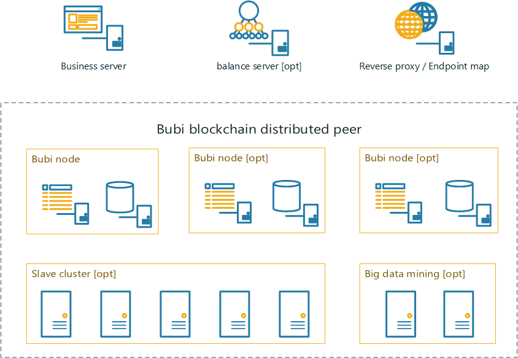
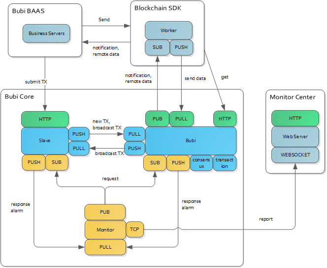
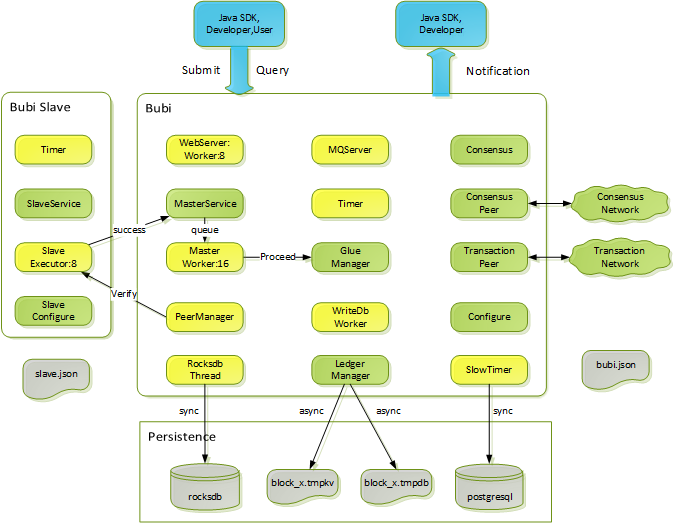
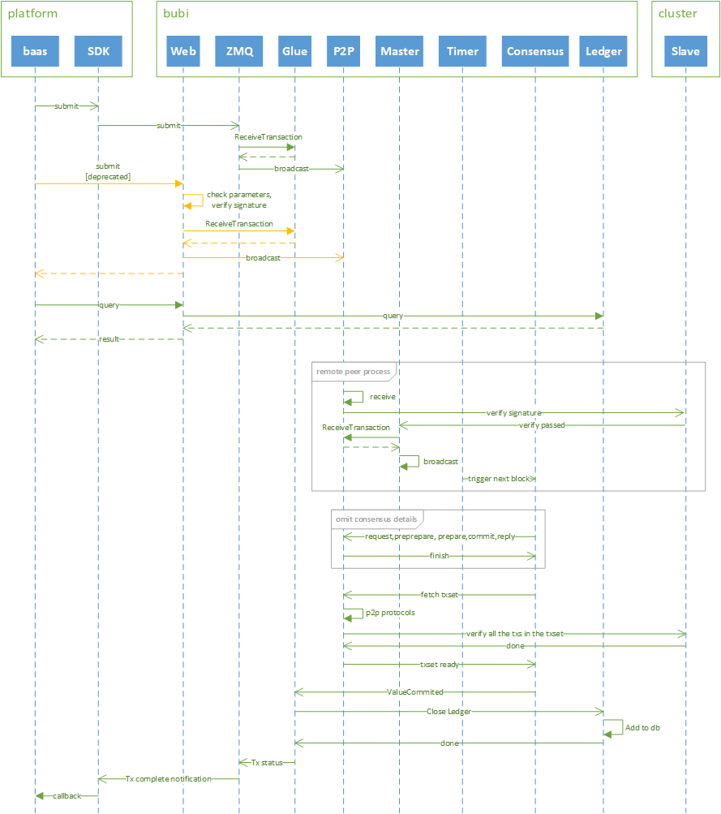

  

### 简介 ###
布比区块链由布比(北京)网络技术有限公司发起并研发，旨在推动区块链技术的发展与应用。目前布比区块链正被广泛应用于商业积分、电子券、预付卡、游戏装备、保险卡单、证券化资产等领域。

- **去中心化** 采用P2P分布式存储，没有中心化的管理节点，可根据实际需求配置若干个验证节点，所有的验证节点具备相同的权利，整个系统的数据块由所有验证节点来共同维护。
- **安全** 数据经过验证节点之间达成共识然后添加至区块链，一旦添加至区块链就会永久存储而且不可篡改，单个节点对数据的修改是无效的。
- **高效** 此版本通过优化数据结构，关键路径多线程并发，多机分布式计算hash，异步写入数据库等方法，使得性能提高明显，普通PC节点可以达3000TPS。集群节点性能更高。
- **稳定** 布比区块链已经商用于布萌数字资产平台一年多，目前（2017年5月7日）累积用户数1013万，周新增用户数14万，周新增交易数110万。
- **开放** 通过公开的API可查询区块链数据，也可根据实际需求修改布比区块链源码。
- **可移植** 使用标准C++开发，支持windows，linux等各种平台

### 架构 ###

布比区块链节点支持分布式部署，以满足高性能，高可靠需求。每个节点至少需要有一个bubi node，即一个bubi进程和一个SQL数据库组成。Bubi node支持横向扩展，以满足高可靠需求。Slave cluster为可选组件，用来分担bubi node的计算，支持动态扩展。Big data mining 为可选组件，可做大数据分析和挖掘。可参考如下部署图。

Balance server 为可选服务，这取决于用户以何种方式使用bubi底层服务。
Reserve proxy或Endpoint map是为了将底层服务部署到广域网。如果部署在云平台，需要在控制台做端口映射即可。 如果部署到自建服务器上，需要在网关做端口映射或部署一个反向代理服务。
### 系统交互 ###
布比底层提供了多种接口，提交交易接口推荐使用SDK方式，这种提交为异步提交，结果会分阶段的通知给应用，比如CONFIRM，PENDING，COMPLETE或者FAILURE。另外可以使用WEB接口提交至bubi 或者slave。 查询请求只能发送到bubi进程。图中的PUB，SUB是ZMQ中的发布订阅模式，PUSH，PULL为任务模式，可以清晰的看到bubi，slave，sdk，monitor之间的通信方式。 Monitor与监控中心采用websocket模式，有利于实时告警。

### 模块 ###
下图描述了bubi和slave内部的主要模块，以及重点模块间的交互。黄色的模块中含有线程，灰色的为外部持久化文件。为了提高性能，减少交易峰值时IO对性能的影响，设计上考虑了异步写入数据库的功能。蓝色为SDK或者使用者，与bubi通信采用web和MQ两种方式。

### 交易流程 ###
下图描述了交易的处理流程。slave不是必须的，如果没有slave，bubi会自己做验签工作。

### 编译 ###

#### Build on Ubuntu 14.04 ####
- 安装依赖

	sudo apt-get install automake autoconf libtool g++ cmake libidn11-dev

	手动安装oracle jdk
- 编译
	./configure
	make
	

- 一键编译

	进入build/linux目录，执行build.sh

#### Build on Windows with VS2013 ####

	使用vs2013打开项目文件 build/win32/bubi.vs12.sln 编译

### 测试 ###
	在test目录下的4peers-without-slave_test.sh 和4peers-with-slave_test.sh，分别用 于部署四个节点带slave和不带slave的测试。带slave的节点配置文件位于test/env/4peers-with-slave/peeri-with-slave目录下，不带slave的节点配置文件位于test/env/4peers-without-slave/peeri-without-slave目录下，i是节点标记1到4。
	
	以test/env/4peers-with-slave/peer1-with-slave目录为例：
	
	bin 存放可执行文件
	
	confg 存放配置文件,bubi.json 是bubi的配置文件，slave.json 是slave的配置文件，可根据实际情况修改配置。bubi.json中db的用户名密码配置需与postgresql安装时设置一致。
	
	log 默认存放日志文件，可以在bubi.json中配置
	
	data 默认存放key-value db数据文件,可在bubi.json中配置
	
	执行test/4peers-without-slave_test.sh启动四个节点不带slave
	
	执行test/4peers-with-slave_test.sh启动四个节点带slave

Copyright © 2016 Bubi Technologies Co., Ltd
